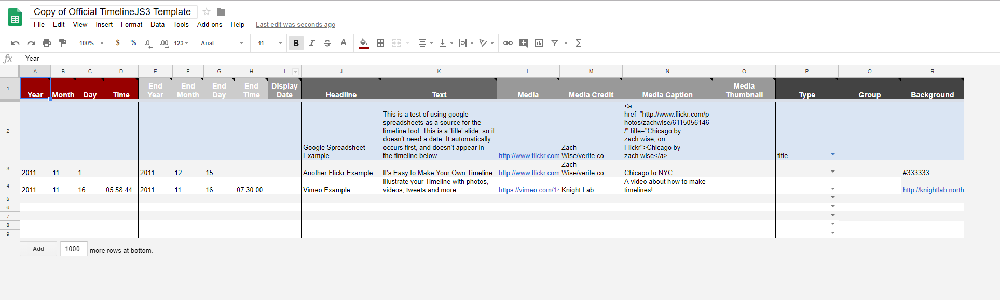
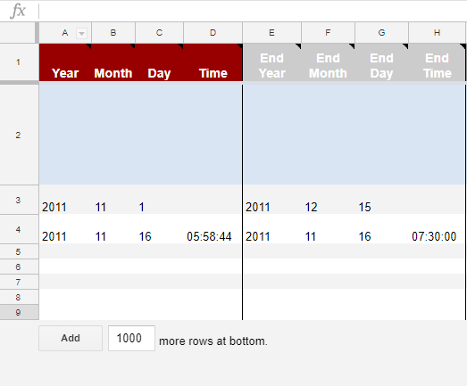
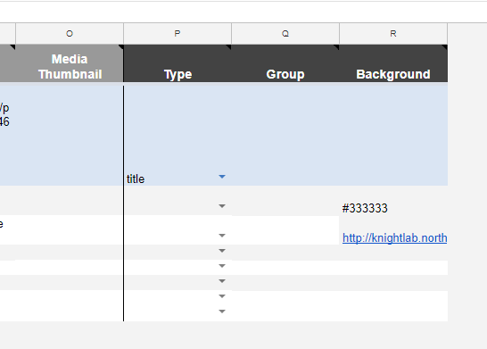
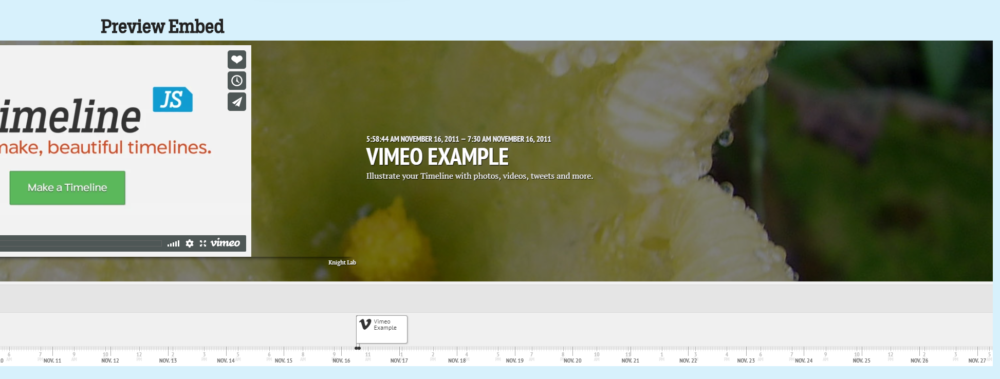
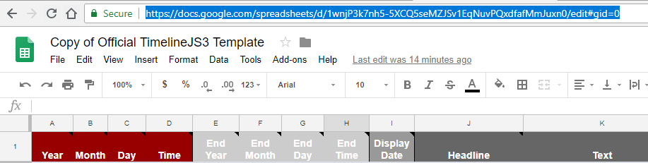
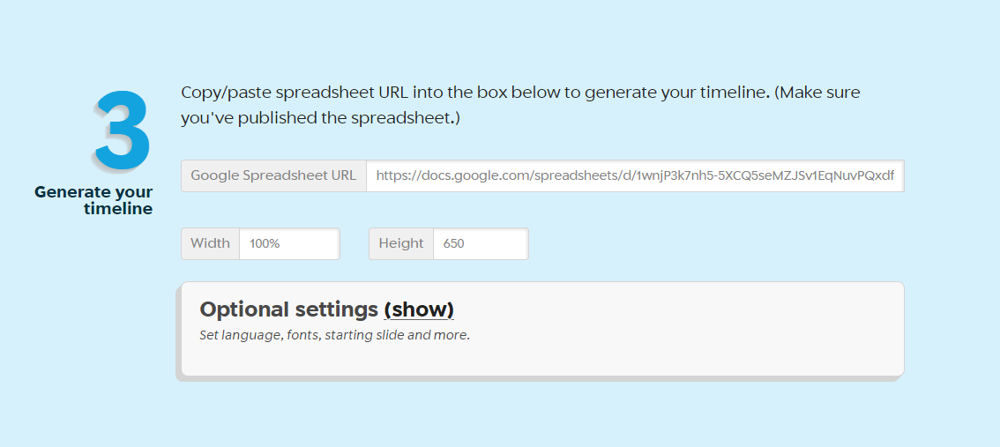

## About
Last Updated  18 April 2018   
Created by Wendy Jordan
Updated by Chelsea Smith-Antonides

## Table of Contents
* [What is Timeline?](#what-is-timeline?)
* [Making a Timeline](#making-a-timeline)
* [Previewing Your Timeline](#previewing-your-timeline)
* [Putting Your Timeline on Your Website](#putting-your-timeline-on-your-website)

## What is Timeline?
Timeline is exactly what it says; it is a tool that can allow you to create a web timeline and include it on your website. It is created by Knightlab, and is located at [https://timeline.knightlab.com/](https://timeline.knightlab.com/).

[Return to Top](#about)

## Making a Timeline
* After going to the TimelineJS website, select the **Make a Timeline** button. This navigates you to the step-by-step instructions on using the website to make a timeline.
* First you need to **Get the Spreadsheet Template**. You will be asked to **Make a Copy** of the Timeline template spreadsheet to your Google Drive.
* The template spreadsheet will automatically open. You now have the ability to fill in your information for your timeline. 

->  <-

* **DO NOT** change any settings in row 1. 
* Each row from 2 on will be a new slide in your timeline. If you need more slides, simply select **ADD (blank) more rows at bottom**.
  This is located on the bottom left of your timeline chart:
  
->  <-

* The columns across the top tell you what information to place: 
  - Beginning Year/Month/Time and Ending Year/Month/Date/Time (the ending date is optional). 
  - Headline is the title that will be shown for that particular row's slide.
  - Text is the body text that will be seen. 
  - Media is the column to include a link to a picture/video you would like to be shown on the timeline. 
  - Media credit gives credit to where the media came from, and 
  - Media caption is the caption that will appear directly under the media (in smaller text than the body text).
* The final columns, **P Q R**, allow you to customize the look of your timeline:

  - The example given, #333333, is a color hex code that represents a specific color. For example, #333333 is a light gray. These hex triplets can be found all around the web. Look around for a neutral color so that your information is easily readable. Bright colors can distract from your information! 
  - You can also use an image for your background. Place the url of an image **Column R, Row 4**. 
  - Here I inserted an image of a flower in **Column R** Let's see how it looks below! 

- This image is not too distracting, and that's exactly what you want to look for if you utilize images. 
  

[Return to Top](#about)
  
## Previewing Your Timeline.
* After filling out your timeline spreadsheet, copy the URL of the page. 

* Navigate back to the Knightlab Timeline page. Paste your URL next to **Step 3** in the **Google Spreadsheet URL** box.

* Next to **Step 4** on the timeline website, your personalized link and HTML for your timeline has been generated. Click on **Preview** to preview your timeline.

[Return to Top](#about)

## Putting Your Timeline on Your Website
* After reviewing your document, copy the **Embed** code that was generated for you next to the **Step 4**.
* Go to your website's admin/edit page. Select the page you wish your timeline to be on.
* Make sure that HTML editing for your page is on, (there may be an 'HTML editor' button for this). Paste your embedded HTML code, and save the changes to page.
  * Step-by-step for Omeka Users
    * Select the page you want the timeline on: a simple or an exhibit page. Go to the **Text** box, click **HTML Editor**.
    * Paste your Html code, and click **OK**.
    * Check the **Public** box to allow the timeline page to be viewed publicly.
    * **Save Changes** to the page.
    * Your timeline is now on your Omeka site. You can view the public page that your Timeline is on to make sure you are satisfied with the appearance.
  * For extra help with Timeline JS, visit [https://timeline.knightlab.com/#help](https://timeline.knightlab.com/#help).   

[Return to Top](#about)
